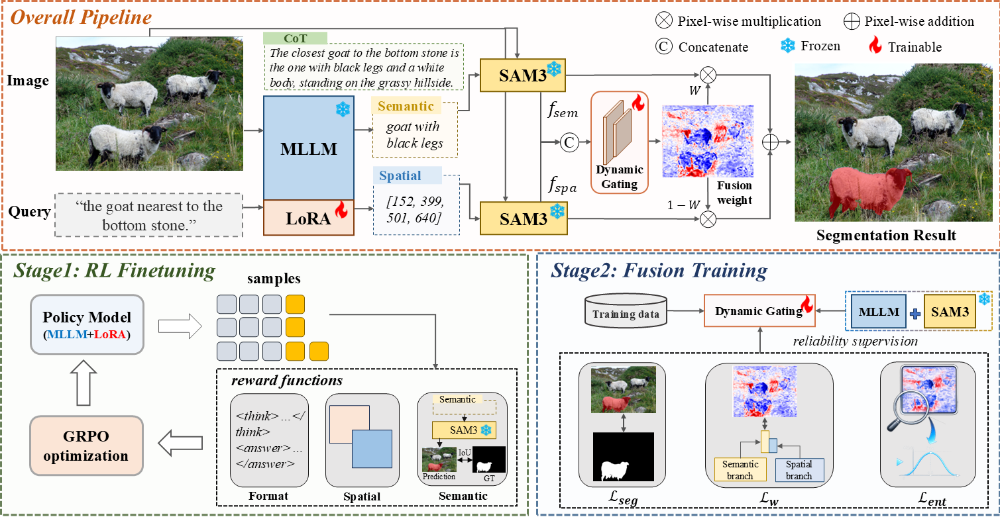

# DGSeg

Official code release for **DGSeg: Dynamic Gating of Semantic-Spatial Guided Predictions for Reasoning Segmentation**.

DGSeg addresses reasoning segmentation, where a model must segment the target object implied by a complex language query. Instead of compressing the reasoning result into a single prompt, DGSeg asks the MLLM to produce complementary target cues: a concise semantic description of what the target is and a spatial box describing where it is. SAM3 then processes these cues in separate semantic and spatial branches. A lightweight dynamic gating module estimates pixel-wise fusion weights from branch features and combines the two mask logits, suppressing noisy or conflicting regions while preserving the MLLM's reasoning intent.




## Repository Layout

```text
DGSeg/
|-- README.md
|-- requirements.txt
|-- assets/
|   `-- method.png
|-- tools/
|   `-- build_refcoco_datasets.py
|-- run_scripts/
|   |-- run_grpo_rec_lora_refcocog_9000_3b.sh
|   |-- run_grpo_rec_lora_refcocog_9000_7b.sh
|   |-- train_fusion_3b.sh
|   `-- train_fusion_7b.sh
|-- sam3/                         # SAM3 code used by DGSeg
`-- src/
    |-- open-r1-multimodal/        # Qwen2.5-VL GRPO training code
    |-- train_fusion/              # SAM3 fusion module training
    `-- reasonseg_eval/            # RefCOCO-family and ReasonSeg evaluation
```

Main entry files:

- `src/open-r1-multimodal/src/open_r1/train_qwen25_refcocog_grpo.py`: Qwen2.5-VL GRPO training on RefCOCOg 9000 samples.
- `src/open-r1-multimodal/src/open_r1/vlm_modules/qwen_module_seg.py`: answer parsing and SAM3-based reward computation.
- `src/train_fusion/train_sam3_fusion_qwen25_3b.py`: fusion module training for Qwen2.5-VL-3B predictions.
- `src/train_fusion/train_sam3_fusion_qwen25_7b.py`: fusion module training for Qwen2.5-VL-7B predictions.
- `src/reasonseg_eval/eval_refcoco.py`: RefCOCO, RefCOCO+, and RefCOCOg evaluation.
- `src/reasonseg_eval/eval_reasonseg.py`: ReasonSeg evaluation.
- `tools/build_refcoco_datasets.py`: builds the DGSeg RefCOCO-family JSON files from REFER-style annotations.

## Environment Setup

The code was developed with Python 3.10, PyTorch, Transformers, TRL, PEFT, DeepSpeed, and CUDA GPUs. A typical setup is:

```bash
conda create -n dgseg python=3.10 -y
conda activate dgseg

pip install -r requirements.txt
pip install flash-attn --no-build-isolation
```

Install the local training package in editable mode:

```bash
cd /path/to/DGSeg/src/open-r1-multimodal
pip install -e .
```

Install the bundled SAM3 package:

```bash
cd /path/to/DGSeg/sam3
pip install -e .
```

Set common paths before training or evaluation:

```bash
export DGSEG_ROOT=/path/to/DGSeg
export DATA_ROOT=/path/to/datasets
export MODEL_ROOT=/path/to/model_weights
export SAM3_REPO_PATH=${DGSEG_ROOT}/sam3
export SAM3_CHECKPOINT=${MODEL_ROOT}/sam3.pt
```

`flash-attn` is optional if your environment does not support it. In that case, edit the training scripts and replace `--attn_implementation flash_attention_2` with a supported attention backend.

## Data Preparation

DGSeg does not redistribute datasets, model weights, generated predictions, or trained checkpoints. The data preparation follows two steps.

### Step 1: Prepare Raw Data

Download COCO images, RefCOCO-family annotations, and ReasonSeg from their official sources. The RefCOCO-family annotations should be organized in the REFER-style format with `instances.json` and `refs(...).p` files:

```text
${DATA_ROOT}/refer_seg/
|-- images/mscoco/images/train2014/        # COCO train2014 images
|-- refcoco/
|   |-- instances.json
|   `-- refs(unc).p
|-- refcoco+/
|   |-- instances.json
|   `-- refs(unc).p
`-- refcocog/
    |-- instances.json
    `-- refs(umd).p
```

ReasonSeg can be placed under:

```text
${DATA_ROOT}/ReasonSeg/
|-- val/
`-- test/
```

### Step 2: Build DGSeg JSON Files

The `*_dataset.json` files used by DGSeg are derived files, not native RefCOCO files. They merge REFER expressions with COCO instance annotations so each sample contains image metadata, category information, segmentation masks, and all referring expressions.

Generate them with:

```bash
cd ${DGSEG_ROOT}
python tools/build_refcoco_datasets.py \
  --refer-root ${DATA_ROOT}/refer_seg \
  --output-dir ${DATA_ROOT}
```

This creates files such as `refcocog_train_dataset.json`, `refcoco_val_dataset.json`, and `refcoco+_testA_dataset.json`. Each item contains fields including `image_file`, `sentences`, and `segmentation`.

Fusion training additionally requires cached Qwen2.5-VL predictions on the RefCOCOg training set, for example:

```text
${DGSEG_ROOT}/data/refcocog_train_predictions_3b.jsonl
${DGSEG_ROOT}/data/refcocog_train_predictions.jsonl
```

Each JSONL record should contain the model output text and image sizes, either as a list:

```json
["<answer>{...}</answer>", 1024, 1024, 480, 640]
```

or as a dictionary:

```json
{"output_text": "<answer>{...}</answer>", "input_h": 1024, "input_w": 1024, "img_h": 480, "img_w": 640}
```

Generate this cache with the RefCOCO-family inference entry before Stage 2:

```bash
cd ${DGSEG_ROOT}/src/reasonseg_eval
DATASET=refcocog SPLIT=train DEBUG_MODE=true CACHE_ONLY=true \
REFCOCO_JSON_DIR=${DATA_ROOT}/refcocog_train_dataset.json \
TARGET_JSON_FILE=${DGSEG_ROOT}/data/refcocog_train_predictions.jsonl \
torchrun --nproc_per_node=2 eval_refcoco.py
```

Use `refcocog_train_predictions_3b.jsonl` as `TARGET_JSON_FILE` for the 3B model.

## Training

Before training, set the common paths used by the scripts, especially `DGSEG_ROOT`, `DATA_ROOT`, `MODEL_PATH`, `SAM3_CHECKPOINT`, and the relevant data paths.

### Stage 1: RL Finetuning

Run the RefCOCOg-9000 GRPO finetuning script for the desired Qwen2.5-VL scale:

```bash
bash run_scripts/run_grpo_rec_lora_refcocog_9000_3b.sh
bash run_scripts/run_grpo_rec_lora_refcocog_9000_7b.sh
```

### Stage 2: Fusion Training

After obtaining cached Qwen2.5-VL predictions, train the SAM3 fusion module:

```bash
sbatch --partition=<partition> run_scripts/train_fusion_3b.sh
sbatch --partition=<partition> run_scripts/train_fusion_7b.sh
```

Replace `<partition>` with a partition available on your Slurm cluster. Set
`CONDA_ENV` only when using an environment name other than `dgseg`.

## Evaluation

The evaluation scripts support both full inference and cached-output evaluation. If `DEBUG_MODE=true` and `TARGET_JSON_FILE` exists, cached Qwen2.5-VL outputs are reused.

For RefCOCO-family evaluation, configure the split-related variables in the shell or script (`DATASET`, `SPLIT`, `REFCOCO_JSON_DIR`, `IMAGE_FOLDER`, `MODEL_PATH`, `SAM3_CHECKPOINT`, and `FUSION_CKPT`) and run:

```bash
cd ${DGSEG_ROOT}/src/reasonseg_eval
CUDA_VISIBLE_DEVICES=0,1 torchrun --nproc_per_node=2 eval_refcoco.py
```

For ReasonSeg evaluation, configure `REASONSEG_JSON_DIR`, `MODEL_PATH`, `SAM3_CHECKPOINT`, and `FUSION_CKPT`, then run:

```bash
cd ${DGSEG_ROOT}/src/reasonseg_eval
CUDA_VISIBLE_DEVICES=0,1 torchrun --nproc_per_node=2 eval_reasonseg.py
```

## Acknowledgements

This project has referenced some excellent open-source repositories ([VLM-R1](https://github.com/om-ai-lab/VLM-R1), [SAM3](https://github.com/facebookresearch/sam3)). Thanks for their wonderful works and contributions to the community.

## Citation

If you find this repository useful, please cite the DGSeg paper. The BibTeX entry will be added after publication.

